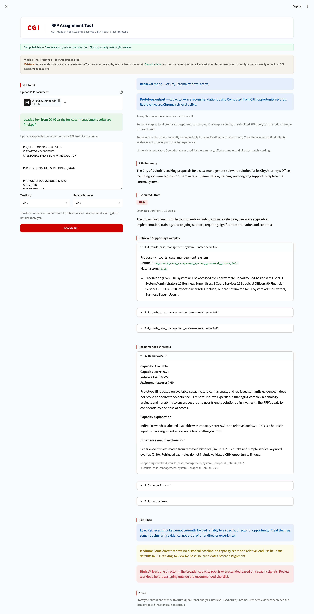

# App-Level QA & Client Data Replacement Report

The purpose of this report is documenting the verification results of the Streamlit application after replacing the demo data with CGI's actual spreadsheet data.

## 1. Data Replacement and Pipeline Execution

First of all, move the newest data `anonymized_opps_1.xlsx` into the `data/` folder, then run the code below:
```bash
python -m src.opportunity_cleaner --opps1-path data/anonymized_opps_1.xlsx
```
The code ran successfully, and generated the processed output `.csv` files in the `data/processed` directory. Upon launching the application using `streamlit run app/app.py`, there were no obvious error logs in the backend terminal.

## 2. Dashboard Rendering and Stability

The Director Capacity Dashboard demonstrated excellent stability with the newly loaded CGI data. 


When navigating to the dashboard via the sidebar, the page loaded successfully without crashing. All core charts, including the Relative Load chart, and the owner-level summary table rendered correctly with the new data points properly aligned. Furthermore, the UI text and disclaimers remained appropriately conservative, successfully retaining the "processed / computed CRM-derived data" phrasing without introducing any overclaims like "Live Data".

## 3. RFP Assignment Workflow

The RFP Assignment Tool was also smoke-tested and performed as expected. 



The initial page loaded normally upon navigation. After copying and pasting a sample RFP text into the tool, the entire analysis pipeline executed smoothly and successfully returned recommended directors. The results page accurately displayed the current retrieval mode (e.g., `azure_chroma` or `local_fallback`), and the generated Risk Flags reasonably reflected the constraints and context of the new data.

## 4. Resilience Testing

A failure-state check was conducted to test the application's resilience. When the `data/processed` folder was temporarily renamed to simulate missing data, the dashboard gracefully handled the absence of data by throwing a clear informational warning message rather than experiencing a complete crash. This confirms the robustness of the application's fallback and error-handling logic.

## 5. Next Steps for CGI
Users from CGI can now place their new batches of spreadsheets into data/csv_files and run the pipeline independently using the CLI command.
